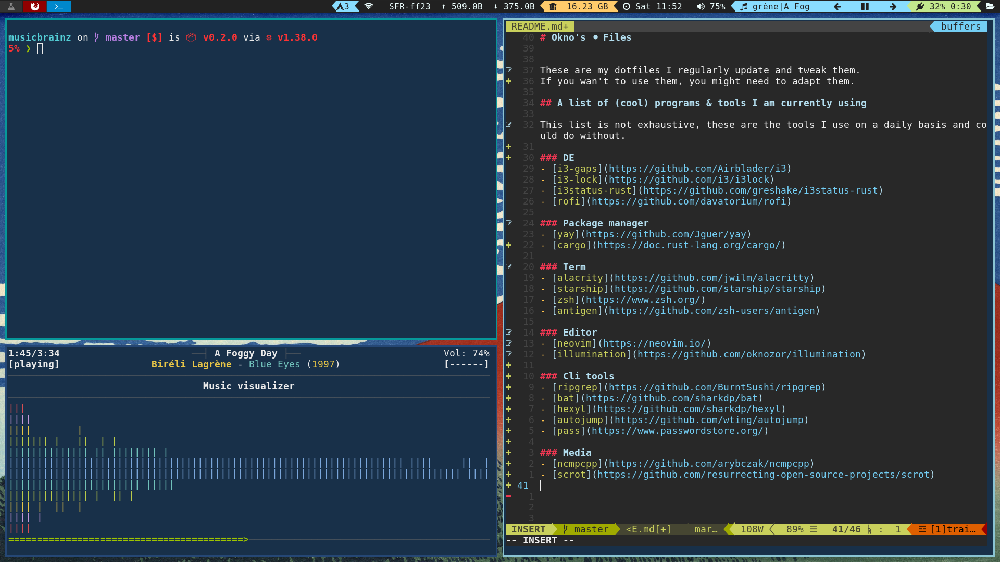
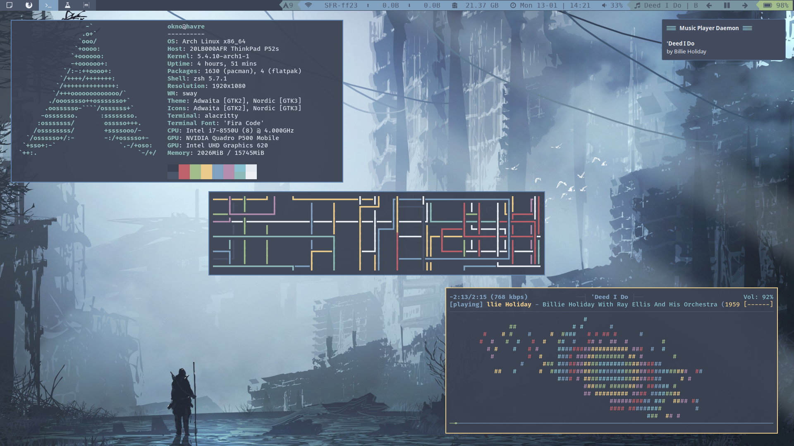
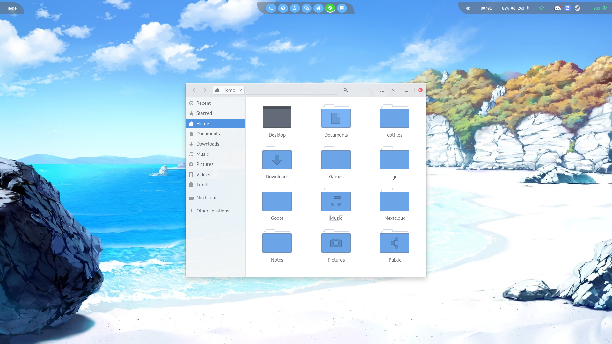
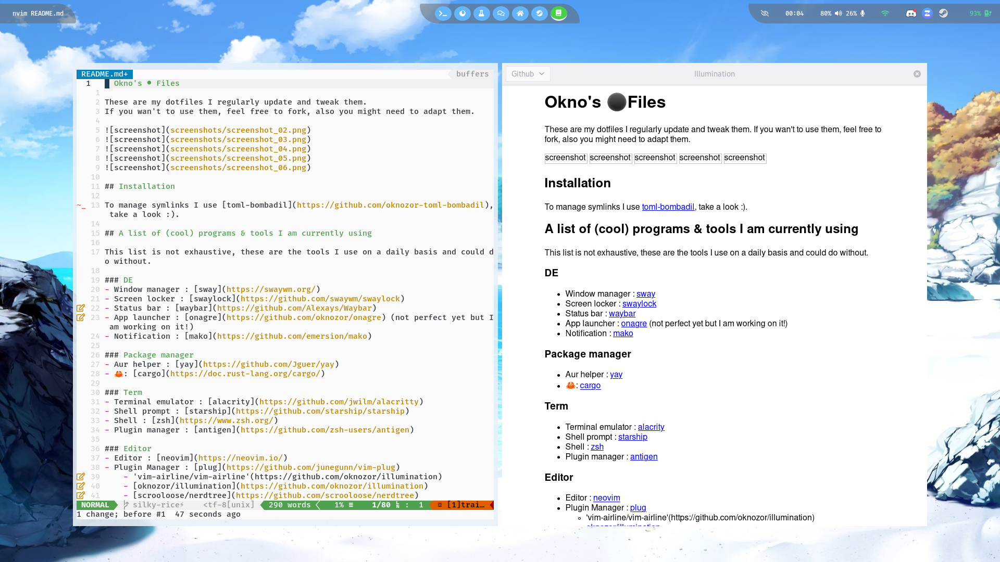
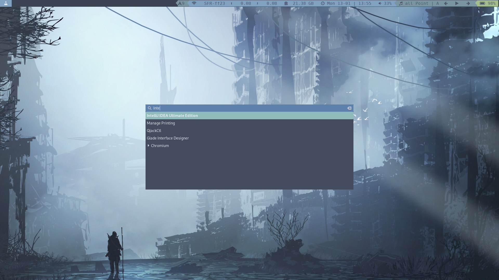
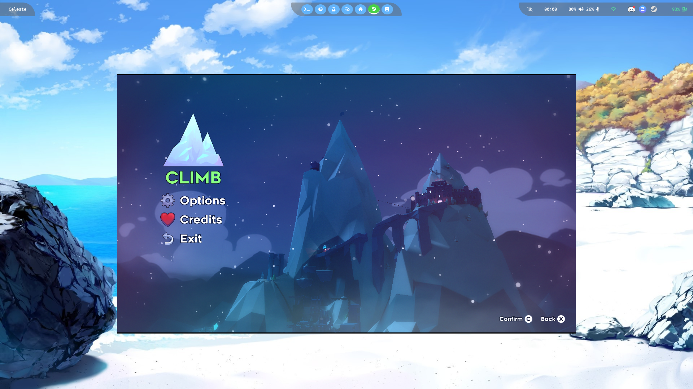

# Okno's ⚫Files 

These are my dotfiles I regularly update and tweak them.
If you wan't to use them, feel free to fork, also you might need to adapt them. 

## Installation 

To manage symlinks I use [toml-bombadil](https://github.com/oknozor/toml-bombadil), take a look :). 

## A list of (cool) programs & tools I am currently using   

This list is not exhaustive, these are the tools I use on a daily basis and could do without.

### DE
- Window manager : [sway](https://swaywm.org/)
- Screen locker : [swaylock](https://github.com/swaywm/swaylock)
- Status bar : [waybar](https://github.com/Alexays/Waybar)
- App launcher : [onagre](https://github.com/oknozor/onagre) (not perfect yet but I am working on it!)
- Notification : [mako](https://github.com/emersion/mako)

### Package manager
- Aur helper : [yay](https://github.com/Jguer/yay)
- 🦀: [cargo](https://doc.rust-lang.org/cargo/)

### Term
- Terminal emulator : [alacrity](https://github.com/jwilm/alacritty)
- Shell prompt : [starship](https://github.com/starship/starship)
- Shell : [zsh](https://www.zsh.org/)
- Plugin manager : [antigen](https://github.com/zsh-users/antigen)

### Editor
- Editor : [neovim](https://neovim.io/)
- Plugin Manager : [plug](https://github.com/junegunn/vim-plug)
    - 'vim-airline/vim-airline'(https://github.com/oknozor/illumination)
    - [oknozor/illumination](https://github.com/oknozor/illumination)
    - [scrooloose/nerdtree](https://github.com/scrooloose/nerdtree)
    - [Raimondi/delimitMate](https://github.com/Raimondi/delimitMate)
    - [airblade/vim-gitgutter](https://github.com/airblade/vim-gitgutter)
    - [RRethy/vim-illuminate](https://github.com/RRethy/vim-illuminate)
    - [airblade/vim-rooter](https://github.com/airblade/vim-rooter)
    - [tpope/vim-fugitive](https://github.com/tpope/vim-fugitive)
    - [pearofducks/ansible-vim](https://github.com/pearofducks/ansible-vim)
    - [rust-lang/rust.vim](https://github.com/rust-lang/rust.vim)
    - [aliou/bats.vim](https://github.com/aliou/bats.vim)
    - [hashivim/vim-vagrant](https://github.com/hashivim/vim-vagrant)
    - [chr4/nginx.vim](https://github.com/chr4/nginx.vim)
    - [racer-rust/vim-racer](https://github.com/racer-rust/vim-racer)
    - [cespare/vim-toml](https://github.com/cespare/vim-toml)
    - [w0rp/ale](https://github.com/w0rp/ale)
    - [neoclide/coc.nvim](https://github.com/neoclide/coc.nvim)
    - [norcalli/nvim-terminal.lua](https://github.com/norcalli/nvim-terminal.lua)
    - [norcalli/nvim-terminal.lua](https://github.com/norcalli/nvim-terminal.lua)

### Cli tools
- Grep replacement : [ripgrep](https://github.com/BurntSushi/ripgrep)
- Find replacement : [ripgrep](https://github.com/sharkdp/fd)
- Cat replacement : [bat](https://github.com/sharkdp/bat) 
- Hexdump replacement : [hexyl](https://github.com/sharkdp/hexyl) 
- du replacement : [dust](https://github.com/bootandy/dust) 
- Quick file navigation : [autojump-rs](https://github.com/xen0n/autojump-rs)
- Password managment : [pass](https://www.passwordstore.org/)

### Media
- Media library management : [beets](http://beets.io/)
- Music player : [ncmpcpp](https://github.com/arybczak/ncmpcpp)
- Screenshot : [grim](https://github.com/resurrecting-open-source-projects/scrot) + [slurp](https://github.com/emersion/slurp)

## Wallpaper 

[This one](https://wallup.net/preview/?wallpaper=drawing-landscape-sea-beach-sand-sky-rock).

## Contributions 

These are my personal dotfiles, it's very unlikely I accept any PRs unless it's supa dupa. Nevertheless, if you have any questions and need help to use these dotfiles, [issues are welcome!](https://github.com/oknozor/dotfiles/issues). 
